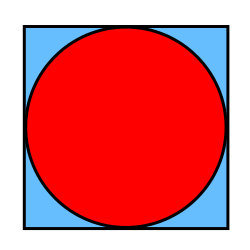

# Proyecto 3 - Base de Datos Multimedia

## Datos generales
- `Curso:` Base de Datos III - cs2702.
- `Profesor:` Heider Sanchez.

### Integrantes
- Andrea Díaz
- Diego Cánez
- Maor Roizman

## Descripción
Este proyecto está enfocado a la construcción óptima de una estructura multidimensional para dar soporte a las búsqueda y recuperación eficiente de imágenes en un servicio web de reconocimiento facial.

### Objetivo del Proyecto
El logro del estudiante está enfocado a entender y aplicar los algoritmos de búsqueda y recuperación de la información basado en el contenido.

### Frontend


### Construcción del índice RTree

Se genera un vector caracteristico de todas las imagenes del dataset Labeled Faces in the Wild (LFW), usando [face_recognition](https://face-recognition.readthedocs.io/en/latest/readme.html) de Python. Este modelo tiene 99.38% de accuracy en el mismo benchmark dataset.

Se hizo un wrapper de la libreria [rtree](https://rtree.readthedocs.io/en/latest/) en Python para la construccion del indice espacial. 

Todos los vectores caracteristicos generados anteriormente se insertan en nuestro rtree como puntos junto a un identificador unico para poder recuperar la imagen original.

### Algoritmo de búsqueda KNN

Returns a list of indices of the images.

```python
rtree.knn(p: Point, k: int) -> List[int]:
    return list(self.idx.nearest(to_box(p), k))
```


### Algoritmo de búsqueda por Rango

En vez de hacer un circular query, esta se hace en dos fases:
1. Query en un bounding box.
2. Post-filtro para eliminar esquinas.



```python
rtree.contained(center: Point, r: float) -> List[int]:
    box = [x - r for x in center] + [x + r for x in center]
    return [
        item.id for item in self.idx.intersection(box, objects=True)
        if np.linalg.norm(to_point(item.bbox) - center) <= r
    ]
```

### Análisis y discusión de la experimentación.

Comparación de tiempo(segundos) de la búsqueda KNN en el RTree y de manera secuencial usando un _k = 8_ en todos los tests. Para medir el tiempo de ejecución de cada búsqueda utilizamos la libreria [pytest-becnchmark](https://pypi.org/project/pytest-benchmark/)
|           | KNN - RTree | KNN - Secuencial |
|-----------|-------------|------------------|
| N = 100   |    0.0002   |      0.0003      |
| N = 200   |    0.0003   |      0.0006      |
| N = 400   |    0.0005   |      0.0011      |
| N = 800   |    0.001    |      0.0023      |
| N = 1600  |    0.0019   |      0.0045      |
| N = 3200  |    0.0041   |      0.0023      |
| N = 6400  |    0.0092   |      0.0184      |
| N = 12800 |    0.0191   |      0.0378      |

### Video de presentación
